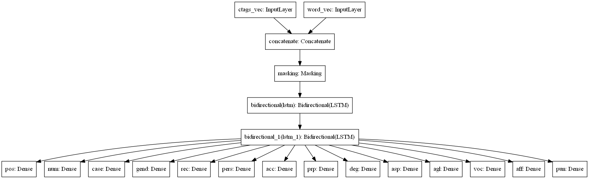

# Work in progress. Not ready to use yet.

Lemmatizer for Polish
=====================

Python library to provide lemmas and morphological categories for tokenized text in Polish.

How to use
----------

Install in your local environment:

.. code:: console

  pip install lemmatizer-pl

Use in your code:

.. code:: python

  > import toygger

  > lemmatizer = toygger.Lemmatizer()
  > tokens = lemmatizer.lemmatize('Gdzie byłeś wczoraj wieczorem, kolego?'.split())
  > for token in tokens:
  >  print(f'{token.token} {token.lemma} {token.pos}')

  gdzie gdzie okolicznik
  byłeś być czasownik
  wczoraj wczoraj okolicznik
  wieczorem wieczór okolicznik
  ,
  kolego kolega rzeczownik

Evaluation
----------

Time to load warm up (loading dictionary and wordnet)
Time to predict for xxxx tokens: ???s (???s/token)
Time to analyze and predict for xxxx tokens: ???s (???s/token)

Disambiguation accuracy on token level:
  Average: ?? %
  For tokens with more than one ctag candidate: ?? %
  For POS category only

Design
------

The whole process is decomposed into three stages:

1. **morphological analysis** is a dictionary look-up, resulting in sets of
   possible lemmas and tags assigned to each token.
2. **morphosyntactic disambiguation**, ruling out contextually inappropriate
   tags assigned during the previous stage.
3. **lemmatization**, selecting lemmas for disambiguated tags.

Morphological analysis looks in one of provided dictionaries.

Morphological disambiguation use refactored version of `Toygger`_ tagger that won `PolEval 2017`_
contest and has been described in:

* Krasnowska-Kieraś Katarzyna (2017). `Morphosyntactic disambiguation for Polish with bi-LSTM neural networks`_.
  In Zygmunt Vetulani and Patrick Paroubek (eds.) *Proceedings of the 8th Language &
  Technology Conference: Human Language Technologies as a Challenge for Computer Science and
  Linguistics*, pp. 367–371, Poznań, Poland. Fundacja Uniwersytetu im. Adama Mickiewicza w Poznaniu.

.. _Toygger: http://mozart.ipipan.waw.pl/~kkrasnowska/PolEval/src/SCWAD-tagger/
.. _PolEval 2017: http://2017.poleval.pl/
.. _Morphosyntactic disambiguation for Polish with bi-LSTM neural networks: PolEval1-2.pdf

Here's network model used for NKJP tagset:

Tagsets and dictionaries
------------------------

Tags provided during morphological analysis come from a tagset. This requires the dictionary to
use tagset and disambiguation model to be trained on samples annotated in the same tagset.
If you need to use a different tagset, you need to have dictionary using it and train disambiguation
model on samples annotated with the new tagset.

* `NKJP tagset`_, dictionary, pretrained model,
* `Polimorf tagset`,

.. _NKJP tagset: http://nkjp.pl/poliqarp/help/ense2.html

Setting up dev environment
--------------------------

.. code:: console

  conda env create --file environment.yml
  conda activate lemmatizer-env

You may want to install custom build of tensorflow, e.g.: here are binaries for Windows:
https://github.com/fo40225/tensorflow-windows-wheel/tree/master/1.13.1/py37/CPU/avx2

How to train
------------

Features/Trade-offs
-------------------

Morfeusz performs both segmentation (tokenization) and morphological analysis.

That would require segmentation to be disambiguated as well. I wanted input for POS tagging to be
dismabiguated first.

 Unlike Morfeusz, this solution
never splits orthographic ("space-to-space") words into smaller dictionary words
(i.e. so-called agglutination is not considered). E.g. in "Coś zrobił?" the word "coś" can be either
interpreted as a noun (meaning "Czy on coś zrobił?") or as a noun "co" with past tense suffix "ś"
(meaning "Co zrobiłeś"?). It simply assumes sentence has been segmented before morphological
analysis.

Formy:
https://github.com/morfologik/polimorfologik/blob/master/src/README.Polish.txt

Data
----

* Polimorf dictionary: http://download.sgjp.pl/morfeusz/20190818/polimorf-20190818.tab.gz
* Word vectors based on NKJP and Wiki (forms): http://dsmodels.nlp.ipipan.waw.pl/dsmodels/nkjp+wiki-lemmas-all-300-skipg-ns.txt.gz
* Word vectors based on NKJP and Wiki (lemmas): http://dsmodels.nlp.ipipan.waw.pl/dsmodels/nkjp+wiki-forms-all-300-skipg-ns.txt.gz
* FastText word vectors for Polish: https://dl.fbaipublicfiles.com/fasttext/vectors-crawl/cc.pl.300.vec.gz

License
-------

Lemmatizer code - GPL license, inherited from Toyyger
Dictionary -
Pretrained disambiguation model -
* FastText: Creative Commons Attribution-Share-Alike License 3.0.,
            https://creativecommons.org/licenses/by-sa/3.0/
            E. Grave*, P. Bojanowski*, P. Gupta, A. Joulin, T. Mikolov, Learning Word Vectors for 157 Languages
            https://arxiv.org/abs/1802.06893
Word vectors:

